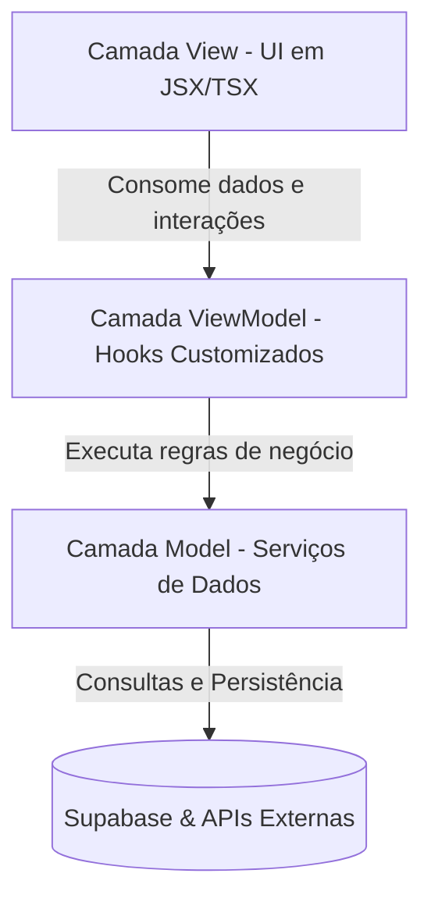

# NextiBR — Portal Institucional & Projeto AURA

<p align="center">
  
</p>

---

O **Portal Institucional da NextiBR** é a vitrine da nossa startup de tecnologia, selecionada no **Programa Centelha PI** (programa de aceleração e estímulo à inovação do Piauí). O site apresenta nossa proposta de valor e destaca o **AURA (Affective Understanding & Response Analysis)**, nossa plataforma de inteligência artificial voltada para classificação e análise emocional de textos em português brasileiro.

O projeto conta também com uma área administrativa restrita (`/admin`) que atua como um mini CMS para gerenciar notícias do carrossel institucional e textos de apoio do portal.

---

## 🚀 Tecnologias Utilizadas

A aplicação foi desenvolvida utilizando tecnologias modernas e de alta performance no ecossistema web:

*   **Framework/Core**: [React 19](https://react.dev/) & [TypeScript](https://www.typescriptlang.org/)
*   **Roteamento e Servidor**: [TanStack Start](https://tanstack.com/router/v1/docs/start/overview) (Roteamento baseado em arquivos, SSR e hidratação otimizada)
*   **Gerenciamento de Estado & Cache**: [TanStack Query (React Query)](https://tanstack.com/query/v3/)
*   **Estilização**: [Tailwind CSS](https://tailwindcss.com/)
*   **Ícones**: [Lucide React](https://lucide.dev/)
*   **Backend & Banco de Dados**: [Supabase](https://supabase.com/) (Autenticação, RLS e Banco de Dados PostgreSQL)
*   **Formulários & Validação**: [React Hook Form](https://react-hook-form.com/) & [Zod](https://zod.dev/)
*   **Envio de E-mail**: [FormSubmit API](https://formsubmit.co/) (Serviço serverless para envio client-side)

---

## 🏛️ Arquitetura e Padrões de Projeto

Visando a manutenibilidade, testabilidade e separação completa de conceitos, a base de código foi refatorada e organizada no padrão **MVVM (Model-View-ViewModel)** seguindo os princípios **SOLID**:



### Divisão das Camadas:

1.  **Model (Modelos de Dados e Serviços)**:
    *   Localizada em `src/models/`.
    *   Contém classes de serviços estáticos (`AuthModel`, `NewsModel`, `SiteContentModel`, `ContactModel`).
    *   Encapsula todas as consultas do Supabase e chamadas HTTP externas. Nenhuma View ou ViewModel faz requisições diretas ao banco de dados.
2.  **ViewModel (Lógica de Apresentação)**:
    *   Localizada em `src/viewmodels/`.
    *   Custom hooks (`useAuthViewModel`, `useAdminViewModel`, `useHomeViewModel`, `useContactViewModel`).
    *   Contêm toda a reatividade, controle de estado local (inputs, loadings, modais), validações com Zod e manipulação do cache com React Query. Não possuem nenhum elemento visual (HTML/JSX).
3.  **View (Componentes Visuais de UI)**:
    *   Localizada nas rotas (`src/routes/`) e componentes (`src/components/`).
    *   São telas e blocos de código focados estritamente em renderização, estilização com Tailwind CSS e binding (ligação) simples com o ViewModel.

---

## 🛡️ Segurança e Níveis de Acesso

O painel de CMS em `/admin` é protegido por autenticação via Supabase e regras de nível de linha (**Row Level Security - RLS**) no PostgreSQL.

### Autenticação & Autorização Automática:
*   A permissão de administrador é gerida pela tabela `public.user_roles`.
*   O trigger automático de banco de dados (`on_auth_user_created`) intercepta novos cadastros e concede a flag de **`admin`** **estritamente** para contas criadas com o e-mail oficial:
    👉 **`nextibr.tech@gmail.com`**
*   Qualquer outro endereço de e-mail que se cadastrar na aplicação receberá automaticamente o papel de `user` (usuário padrão), ficando impossibilitado de ler mensagens ou editar notícias/conteúdos institucionais.

---

## 📦 Como Configurar e Executar Localmente

### Pré-requisitos
*   Node.js (v18+)
*   Gerenciador de pacotes `npm` ou `bun`

### 1. Clonar e Instalar Dependências
```bash
git clone https://github.com/nextibr/NextiBR.git
cd NextiBR
npm install
```

### 2. Configurar Variáveis de Ambiente
Crie um arquivo `.env` na raiz do projeto (ou edite o existente) e preencha as variáveis correspondentes ao seu projeto do Supabase:
```env
SUPABASE_PROJECT_ID="seu_project_id"
SUPABASE_PUBLISHABLE_KEY="sua_anon_public_key"
SUPABASE_URL="https://seu_project_id.supabase.co"

VITE_SUPABASE_PROJECT_ID="seu_project_id"
VITE_SUPABASE_PUBLISHABLE_KEY="sua_anon_public_key"
VITE_SUPABASE_URL="https://seu_project_id.supabase.co"
```

### 3. Rodar as Migrações de Banco de Dados
Acesse o painel do seu projeto no Supabase, vá em **SQL Editor** ➔ **New Query** e execute os códigos dos scripts SQL locais em ordem:
1.  [`supabase/migrations/20260818124016_32a8ccb3-64c8-402a-866e-0c5e85e3eecf.sql`](supabase/migrations/20260818124016_32a8ccb3-64c8-402a-866e-0c5e85e3eecf.sql) (Estrutura de tabelas e políticas RLS).
2.  [`supabase/migrations/20260821000000_auto_admin_role.sql`](supabase/migrations/20260821000000_auto_admin_role.sql) (Trigger de privilégio admin automático para o e-mail oficial).

### 4. Executar Servidor Local
```bash
npm run dev
```
O portal estará disponível em: **`http://localhost:8080/`**
O painel administrativo em: **`http://localhost:8080/admin`**

### 5. Ativar o Envio de E-mails do Formulário
Ao subir o site, faça o primeiro envio de teste através do formulário de contato. O serviço **FormSubmit** enviará um e-mail de ativação para `nextibr.tech@gmail.com`. Clique no botão de confirmação dentro desse e-mail. Após esse passo de um clique, todos os contatos do portal cairão na sua caixa de entrada automaticamente.

---

## 📄 Licença

Este projeto é de propriedade exclusiva e confidencial da **NextiBR**. Todos os direitos reservados.
